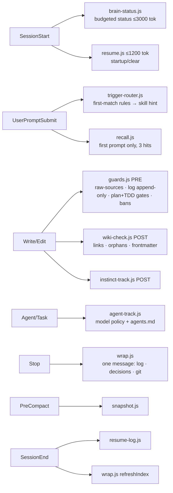

# Brain health audit — research

> **Question:** does this brain follow its own standard (manual `.brain/CLAUDE.md`), are its hooks, skills, agents, MCP servers, dependency plugins and model-routing rules working, and how do we make it cheaper in tokens and better at context management? · **For:** [[brain-hardening]] (spec to draft)

**Method (2026-09-15, plugin v0.29.1, commit `ddc1946`).** Ran `doctor.js`, `lint.js`, `selftest.js` (417 checks), `claude plugin validate --strict` ×2, `usage.js`, `graph.js radius`; piped sample events through every prompt/session hook; queried `brain_search` / `brain_brief`; wrote a transcript analyser for model-switch cache cost (15 main sessions). Two independent read-only subagent audits: hook code (opus, executable probes on scratch brains) and skills/docs/token cost (bytes measured). Every claim below was re-checked in source before filing.

## Verdict

The engine is solid underneath (selftest green on 3 OS × 2 Node in CI, strict manifests, budgeted injection, fail-safe hook I/O), but **the brain gives itself wrong signals**: its resume system injects an empty template, its health check raises a false critical every session, its link checker disagrees with its own linking rules, and it knows almost nothing about the engine it lives in. Two of five shipped dependency plugins are dead on this machine. On tokens, the fixed overhead is small (~7–10k/session); the real cost is **~270k tokens of context re-read on every API call** and **model switches that re-write the whole cache**.

| Component | State | Evidence |
| --- | --- | --- |
| Hooks (11 registered, 10 events) | ✅ run · ⚠ 2 P0, 7 P1-P2 defects | hook audit below |
| Selftest / CI | ✅ 417 ALL GREEN · CI matrix ubuntu/windows/macos × node 18/22 | `.github/workflows/selftest.yml` |
| Manifests | ✅ `--strict` both | plugin + marketplace |
| Skills (25) | ✅ all paths/scripts exist · ⚠ doc drift, contradictions | docs audit below |
| Agents (2) | ⚠ `brain-librarian` told to call a tool it lacks | `agents/brain-librarian.md:17` |
| MCP `brain-search` | ✅ `brain_search` + `brain_brief` answer, always fresh | live calls |
| MCP `github` (dependency) | ❌ fails every session — `GITHUB_PERSONAL_ACCESS_TOKEN` unset | plugin `.mcp.json` header |
| `security-guidance` (dependency) | ❌ never runs — no Python 3 on this machine (error in 14 transcripts) | `python --version` → Store alias |
| `superpowers` (dependency) | ⚠ works, but runs a second lifecycle outside `.brain/` | `docs/superpowers/specs/…` |
| Doctor (19 checks) | ⚠ 1 false critical, 2 checks blind | #14, #18, #19 |
| Knowledge layer | ⚠ 0 sources · 0 concepts · 0 entities · 8 pages | `index.md` |
| Develop lifecycle | ✅ ran end to end twice today | [[develop-lifecycle-fixes-review]], [[research-first-routing-review]] |

## How a message flows through the brain

## What works (verified)
- Hook output shapes match Claude Code (`hookSpecificOutput.additionalContext`; Stop `decision: block`; PreToolUse exit 2); bad stdin → `{}` → exit 0.
- Injection is budgeted and receipted: brain-status ~555–571 tok (budget 3000, `sessions/injection-stats.json`); resume truncates at 1200; recall fires once per session (probe: 1135 B then 0 B), capped at 3 × 200 chars.
- Router is quiet on chatter ("ok", "yes continue", "commit this" → silent) and on quick fixes ("fix typo in README" → silent); dev intent → research-first hint; skip phrase → plan.
- `graph.js radius` works (34 files, cache keyed by mtime); cache-hit ratio 98% over 910 calls.
- Concurrency: 12 simultaneous `resume-log` events → 12/12 lines; `agents.md` is append-only.
- `.brain/CLAUDE.md` = template + placeholders only; `schema/brain-template` byte-identical to the plugin template.

## Findings — what goes wrong → what it should be

### P0
1. **Resume split-brain.** `/brain:init` (`new-brain.js:147-153`) seeded an empty `.brain/resume.md` (scaffold commit `52b7157`). `resume.js:29-31`, `resume-log.js:60-62` and `snapshot.js:22-27` all prefer it, while `/brain:wrap` (`wrap/SKILL.md:39`) tells the model to write the **root** `resume.md` "in the engine repo". Result since 2026-09-15 06:03: every session is injected "_Nothing yet_ / `- [ ] …`" plus "ask the user: continue or start fresh?"; SessionEnd bumps the template's `updated:` so it always looks fresh; pre-compact snapshots copy `- [ ] …` instead of real next steps. The 16.8 KB root narrative (6 stacked dated narratives) is never read. **Should be:** one resume file per project, the same path for every reader and writer; silent when the narrative is still the seed; narrative capped at 2–4 lines with history moved to `wiki/log.md`.
2. **Plan + TDD gates switch off for projects under a `test/`, `tests/` or `spec(s)/` folder.** `guards.js:73` `isTestPath(abs)` tests the *absolute* path; `:277` skips both gates when it matches. Probe: identical brain, unapproved architecture spec, `src/core.js` → `…/ctl` exit 2 (blocked), `…/specs/ctl` exit 0 (allowed). **Should be:** `isTestPath(relProj)`; add a selftest with a parent folder named `specs`.

### P1
3. **The health signal is wrong in three checks.** #14 open-P0 is line-based (`doctor.js:184`, same in `loop.js:35`): "**P0 — …** Fix: …" under a heading "(all fixed)" counts as open → a false **critical** injected into every session by `brain-status.js:123-133`, gating `/brain:wrap`, and a design loop over such a page can never stop. #18 counts phantom dispatches as successes: SubagentStop also fires for Claude Code's internal forks (`agent_type: ""`, no transcript) and `agent-track.js:78-82` logs them `done` — **61 of 69** outcome lines in `sessions/agents.md` are phantoms, so the last-20 window can never warn. #19 reports "no code project" although `.github/workflows/selftest.yml` exists. **Should be:** section-aware P0 status (a resolved heading closes its items, or an explicit per-finding status); skip `!agent_type && 0 records` in `recordOutcome`; #19 detects existing workflows.
4. **Link checking contradicts the linking rules.** `plan/SKILL.md:48`, `review/SKILL.md:38-39`, `research/SKILL.md:33` say link specs and ADRs; `lint.js:61-62` and `wiki-check.js:47-53` resolve only `wiki/`. Obsidian's vault is the repo root (`.obsidian/`), so it resolves them — the checker is the odd one out. 5 permanent false "broken links" teach the model to ignore the warning. Related: manual §3 says `sources: ["[[page]]"]`, every live page uses bare slugs (`sources: [develop-lifecycle-fixes]`) which are neither links nor provenance edges; no template shows the form. **Should be:** resolver + orphan scan cover `specs/`, `decisions/`, `projects/`; templates carry the quoted-wikilink example.
5. **The Stop hook nags about the brain's own writes.** `agent-track` and `resume-log` write tracked files (`sessions/agents.md`, `resume.md`) and compaction adds tracked `sessions/*-precompact.md`, so every session ends dirty and the next session's first Stop blocks with `wrap[git]` (it did in this session). SessionEnd `refreshIndex` (`wrap.js:172-193`) rewrites `index.md` after the log, and `newestWikiMtime` (`:40-49`) excludes only `log.md` → false "log behind" next session. **Should be:** hook-owned files excluded from both nudges (or moved to git-ignored caches with a committed rollup).
6. **The brain does not know its own engine.** 0 sources, 0 concepts, 0 entities; `ROADMAP.md` (73 KB), `README.md` (31 KB), `CHANGELOG.md`, 27 hook scripts never compiled. `brain_brief "hook architecture session start injection token budget"` returned only research-first-routing excerpts. Every engine question is therefore answered by re-reading code — the most expensive path. **Should be:** concept pages per subsystem (injection, router, gates, Stop nudges, resume, search/recall, agent tracking, doctor/lint) and entity pages per dependency plugin, compiled from the roadmap and code.
7. **Two lifecycles.** `superpowers:brainstorming` writes `docs/superpowers/specs/YYYY-MM-DD-<topic>-design.md`; `writing-plans` writes `docs/superpowers/plans/…`. Neither is seen by the plan/TDD gates, the index, recall or `brain_search`. No brain skill mentions superpowers; the curator's standing rule is to always brainstorm first, so every feature risks a design doc outside the brain. **Should be:** the manual (§9) maps superpowers outputs to `.brain/` (design → `wiki/research/` or the spec's Design section, plans → the spec), and a filing hook copies anything written under `docs/superpowers/` into the brain.
8. **Dead dependencies are invisible.** `security-guidance` cannot find Python (non-blocking error on every prompt and edit in 14 transcripts) — the "open P0s gate wrap" security net the manual promises has never run here. The `github` MCP fails at connect (token env unset). Doctor checks neither. **Should be:** doctor #20 "dependency health" (interpreter present, required env vars set, MCP connect state); `/brain:init` asks before enabling a dependency that needs a token or runtime.
9. **Agent definitions and skills overpromise.** `brain-librarian` is told to invoke `/brain:ingest` via Skill but has only `Read, Write, Edit, Grep, Glob` (no Skill, no WebFetch for URL sources, cannot delete the Clippings copy); it says "8-step" and lists 6. `research/SKILL.md:4` pins `model: sonnet` while line 12 and `skills/README.md:56` say synthesis runs "on the main model".
10. **Model-routing enforcement leaks** (`agent-track.js:113-128`): the "pick a model" block is a once-per-session marker, not per dispatch. Live today: the first model-less dispatch was blocked, its parallel sibling ran unpinned on the main model. `selftest.js:612-613` asserts the leak as intended. See the model-routing section.

### P2
| # | Defect | Where | Should be |
| --- | --- | --- | --- |
| 11 | Question exemption only on the dev catch-all: "why did the research-first routing misfire?" → research; "create a new doctor check for the brain" → **init**; "we decided X, now build Y" → dump; the noun "research" in a curator's sentence fired `brain:research` during this audit | `trigger-router.js:322`, `:36` | questions exempt from every rule; action-verb anchoring |
| 12 | "review the entire brain", "audit all plugins and hooks", "is the brain working properly" route nowhere | router rules | route to `/brain:doctor` |
| 13 | `/brain:init` offer repeats on every dev prompt in non-brain repos | `trigger-router.js:326-332` | once per session |
| 14 | Open-spec list in the router hint is uncapped (60 specs → ~1,029 tok per dev prompt) | `:288-296` | cap at 3 + "n more" |
| 15 | Learned bans fire in other repos across drives | `guards.js:321-323` | reuse the `inProject` test |
| 16 | Log's `updated:` line editable to anything | `guards.js:66` | check `new_string` too |
| 17 | Table-escaped `[[b\|B]]` links count as orphans | `wiki-check.js:79` | accept `\|` |
| 18 | `edit-counts.json` and `%TEMP%/mb-*` markers grow forever | instinct-track, markers | prune |
| 19 | Stale numbers: "9 hook events" (10), "158 checks" (417), README tree stops at 14 skills / Phase 8 | `README.md:140`, `plugin/README.md:32,41,178` | generate counts from code |
| 20 | Section refs off by one: spec template says tiers are "§6" (§5); wiki-check/lint cite §5 for §6 rules | `templates/spec.md:5`, `wiki-check.js:11,14,95,100`, `lint.js:92` | fix; ships into every brain |
| 21 | `brain-all` bundle stale (0.14.0; `gen-brain-all.js --check` fails: 293 vs 295) | `bundles/` | regenerate in the release checklist |
| 22 | `schema/CLAUDE.md` (v1, 13.7 KB) and `schema/templates/` are dead | `schema/` | delete or mark superseded |
| 23 | Bootstrap `.sh`/`.ps1` lag `new-brain.js` (no registry, no `@import`, partial `--update`) | `bootstrap/` | thin wrappers over the Node scripts |
| 24 | Index still says "This brain is empty"; ingest step count 8/7/6 across skill/manual/librarian; `game` files GDDs at `wiki/` root with an undeclared `type: gdd`; `wrap` hand-reconciles counts SessionEnd already fixes | various | one definition each |
| 25 | 10 cached brain versions (0.12.1 → 0.29.1, 7 MB) + 4 copies of each official plugin | `~/.claude/plugins/cache` | prune on update |

## Model routing — review

**Where the rules live today (four wordings, no single source).** `agent-track.js:15-16,130` (haiku = triage · sonnet = routine + research fan-out · opus/main = judgment, synthesis, review); `graph.js:214-216` (tier → model); `skills/README.md:44-62` (four work classes: judgment `effort: high` inherit main · routine `model: sonnet` medium · mechanical sonnet low · trivial haiku low); `usage/SKILL.md:24`. The manual states no model policy at all; **Fable is absent from every policy** (only `loop.js:43` knows the family).

**Current pins.** Sonnet: `brief build ci digest dump ingest init learn research usage` + both agents. Haiku: `dashboard home lock terse`. Inherit main (effort high): `plan review loop query lint doctor wrap compress career game product-design`. User settings: `"model": "opus[1m]"`, `"effortLevel": "high"` — so plain conversation runs on the top tier at high effort.

**Measured mix (7 days).** Sonnet 67 % · Opus 19 % · Fable 13 % · Haiku 2 %; subagents 2 % of tokens.

**Measured switch cost (new).** Prompt caches are per model. Over 15 main sessions, same-model calls wrote **4,286** cache tokens on average; the **8** main-thread model switches wrote **162,732** on average and caused **25 %** of all main-thread cache writes (1.30 M tokens). One opus → sonnet switch (a `model: sonnet` skill mid-session) re-wrote **488,844** tokens. A skill pin that saves money on a small context costs money on a long one.

**Assessment of the curator's proposal** (research → opus/fable, coding → sonnet, conversation → haiku):
- *Research → opus/fable:* right for the **lead synthesis and recommendation**, which is judgment. Wrong for the reading slices — fan-out is the most token-heavy phase and is volume work; keep slices on sonnet (haiku for pure grep/classify). Today the opposite happens: the `research` skill pin puts even the synthesis on sonnet.
- *Coding → sonnet:* right, and already pinned on `build`. But in an opus session the pin causes a full cache re-write; coding should run either in a sonnet session or in a sonnet **subagent** with a small context, not as a main-thread pin. Review stays on a different family from the builder (opus/fable) — `loop` already enforces generator ≠ checker.
- *Conversation → haiku:* a hook cannot change the main model (it can only add context or block), so this must be the session's chosen model. Haiku is weakest at multi-step tool work and a conversation in this repo usually turns into tool work within a few turns; switching mid-session triggers the re-write above. Better: choose the session model once at start by the day's work; use haiku for triage **subagents** and trivial skills.

**Recommended policy (one table in manual §5, cited by agent-track, graph.js, README, usage):**

| Work | Runs where | Model | Effort |
| --- | --- | --- | --- |
| Deterministic checks (doctor, lint, graph, usage, dashboard data) | Node scripts | none (0 tokens) | — |
| Triage / classify (dump routing, recall ranking, digest bucketing, commit-message drafts) | subagent | haiku | low |
| Reading fan-out (research slices, codebase sweeps, batch ingest) | subagent | sonnet | medium |
| Coding (build ACs, CI, scaffolds) | sonnet session **or** sonnet subagent | sonnet | medium |
| Research synthesis, plan, architecture | main session | opus (fable for architecture tier) | high |
| Review / adversarial audit | subagent, family ≠ builder | opus or fable | high |
| Conversation | the session model chosen at start | sonnet default; opus/fable on research/plan days | medium |

**What Claude Code allows (verified against docs: skills.md frontmatter table, sub-agents.md, hooks-guide.md, settings-reference.md).** A skill's `model:` / `effort:` apply **only to the turn that invokes it**; the session model resumes on the next prompt — so every pinned skill costs a switch *and* a switch back (the 197k haiku → opus and 77k sonnet → opus re-writes above are those returns). With **`context: fork`** in the same frontmatter, `model:` instead sets a **forked subagent's** model, which runs on a fresh small context with no main-thread switch. Subagent model resolution: Agent-tool `model` param > agent `model:` > `CLAUDE_CODE_SUBAGENT_MODEL` > main model. No hook can set the model, but **`PreModelSwitch`** can allow/deny/ask a requested switch and `PostModelSwitch` can react. `model` and `effortLevel` are valid in project `.claude/settings.json`.

Rules: **change model by forking, never by a main-thread pin in a long context** — routine skills (`build`, `ingest`, `research` slices, `dump`, `digest`, `brief`, `usage`, `ci`, `init`, `learn`) get `context: fork` + their model, or drop the pin; a `PreModelSwitch` hook asks before any switch once the transcript is large; enforce the dispatch block **per dispatch**; add Fable; doctor compares the model mix and switch count against the table; default `effortLevel` medium with `effort: high` only on judgment skills (skill `effort:` is honoured per turn); `/brain:init` can write recommended `model`/`effortLevel` into the project's `.claude/settings.json`. Trade-off: a forked skill does not see the conversation, so it must read its inputs (spec, source) from files — which these skills already do.

## Token & context economics

| Cost | Size | When |
| --- | --- | --- |
| **Context re-read per API call** | **~270k tok** (239.5 M cache-read ÷ 910 calls) | every call |
| Model-switch cache re-write | ~163k tok per switch (25 % of cache writes) | each mid-session switch |
| `.brain/CLAUDE.md` (@import) | 15,946 B ≈ 4.0k | every session |
| 25 brain skill descriptions | 9,887 B ≈ 2.5k | every request |
| Other plugins' listings (superpowers 14 skills, code-modernization 15 skills + 8 agents, …) | not measured, est. several k | every request |
| `using-superpowers` injection | 3,108 B ≈ 0.8k | every session |
| brain-status / resume / router / recall | 0.57k / 0.2k / 0.11k per dev prompt / ~0.3k once | as noted |

**Levers, biggest first.**
1. **Shorter contexts** (dominant): a fixed ~7–10k is noise next to ~270k per call. Add a context-length nudge (a UserPromptSubmit hook that sizes `transcript_path` and, past a threshold, suggests `/brain:wrap` → `/clear`, with the resume file carrying state — which requires P0 #1 fixed). Push heavy reads into subagents (2 % today). Never paste large files; answer from pages.
2. **No mid-session model switches** (−25 % of cache writes): see model routing.
3. **Compile the engine into the brain** (finding 6) so questions cost a 2k `brain_brief` instead of reading 27 scripts.
4. **Fixed-overhead diet** (≈ −3.3–3.5k per session, ~45 %): move manual §9, §10, §8 qmd steps, §4 "Around/Daily/Life packs" and §7 team paragraph to an on-demand `.brain/reference.md` (−1.6k); cap skill descriptions at ~250 B and drop the "Requires a .brain/" line repeated in 11 of them (−0.9k per request); `/brain:compress` the rest (−0.8–1k).
5. **Dependency slimming:** `code-modernization` and `security-guidance` as offered, not hard, dependencies — their listings cost every request in every brain.
6. **Effort default medium** instead of global `high`; judgment skills pin high.
7. **Cheaper skill instructions:** ingest "every page the source informs" instead of "5–10+"; research fans out only past 2 independent slices and does not re-read the wiki the lead read; lint reasoning limited to flagged pages; wrap reuses fresh session evidence instead of re-running suites.

## Recommendation
Treat this as three specs, in order. **(1) `brain-correctness` — quick/feature tier:** P0 #1–2, P1 #3, #5, #10 (resume single source, gate path, doctor #14/#18/#19, hook-owned files out of nudges, per-dispatch model block), each pinned by the missing selftests (both resume files present; parent folder named `specs`; phantom SubagentStop; P0 under a fixed heading). **(2) `token-diet` — feature tier:** model-routing table in the manual + subagent-not-pin rule + Fable, context-length nudge, manual split, description cap, dependency slimming, effort default. **(3) `engine-knowledge` — feature tier:** ingest ROADMAP/README/CHANGELOG, subsystem concept pages, link resolver across records, superpowers artifact routing, router question exemption + audit phrasings. P2 docs drift can ride along with (1). Environment fixes are the curator's: install Python 3 (or disable `security-guidance`), set `GITHUB_PERSONAL_ACCESS_TOKEN` (or disable the github MCP), prune old plugin caches.

## Filed
Feeds: [[brain-hardening]] (spec to draft — split into the three above) · Sources: this session's tool runs and two subagent audits (hook code, skills/docs); prior pages [[develop-lifecycle-dogfood]] · [[research-first-entry]] · [[develop-lifecycle-fixes-review]] · [[research-first-routing-review]].
