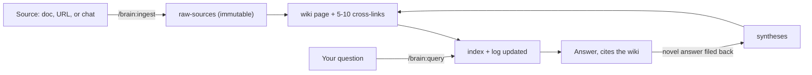
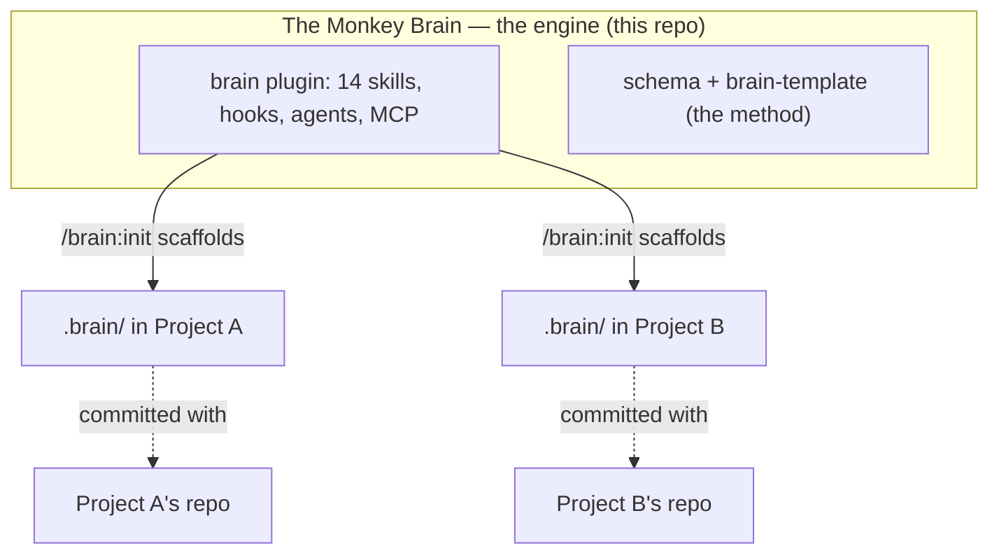

# 🐵 The Monkey Brain

> A reusable **knowledge engine** you drop into any project. Each project grows its own
> isolated, **compounding** wiki — its topics, context, and memories — maintained by Claude Code
> instead of by you.


The Monkey Brain turns Claude Code into a **librarian for your project**. Instead of re-reading
raw documents on every question (RAG), it **compiles knowledge once** into a persistent,
interlinked markdown wiki and keeps it current — so cross-references, contradiction flags, and
synthesis already exist *before* you ask. Knowledge accumulates instead of being re-derived.

> **You curate** (sources, questions, direction). **The engine maintains** (summarizing,
> cross-referencing, filing, linting, remembering). **Obsidian is the IDE; the wiki is the codebase.**

---

## Table of contents

- [What is The Monkey Brain?](#what-is-the-monkey-brain)
- [Features](#features)
- [Quickstart](#quickstart)
- [How it works](#how-it-works)
- [Architecture](#architecture)
- [Structure](#structure)
- [User guide](#user-guide)
- [Requirements](#requirements)
- [The example brain](#the-example-brain)
- [Credits & license](#credits--license)

---

## What is The Monkey Brain?

Most AI workflows re-retrieve the same source documents on every question and re-derive the same
answers, forgetting everything between sessions. The Monkey Brain does the opposite: it builds a
**second brain that compounds**.

It is an implementation of the [**LLM Wiki pattern**](https://gist.github.com/karpathy/442a6bf555914893e9891c11519de94f)
(Andrej Karpathy) — itself a modern take on Vannevar Bush's 1945 *Memex*. The idea: rather than
retrieval-augmented generation over raw files, the LLM **incrementally builds and maintains a
persistent, interlinked wiki**. Every source you feed it is summarized, cross-linked to 5–10
related pages, indexed, and logged. Every question is answered from that wiki, and good novel
answers are **filed back** as new pages. The knowledge base gets richer with use.

**Two roles, cleanly split:**

| You (the curator) | The engine (the maintainer) |
| --- | --- |
| Choose sources & set direction | Summarize sources into wiki pages |
| Ask questions | Answer from the wiki, cite pages |
| Approve plans & decisions | Cross-link, index, log, lint, remember |
| Review the output | Enforce the rules automatically |

**One engine, many isolated brains.** This repository is *the engine* — a Claude Code plugin. It
holds no project knowledge itself. Instead it scaffolds a `.brain/` folder into each of your
projects; that folder is committed with the project's own git and stays **completely isolated**
from every other project. Knowledge never bleeds across projects.

The engine stands on three pillars:

- **Compound** — the LLM wiki: compile-time cross-linking, provenance, contradiction flags.
- **Enforce** — hooks and gates make the rules non-negotiable (*enforcement over advice*).
- **Economize** — token discipline, model routing, and deferred tools keep it cheap.

---

## Features

**🧠 A compounding knowledge base**
- The **knowledge SDLC**: `ingest → query → lint → wrap`, each step a `/brain:*` skill.
- Sources become cross-linked wiki pages with YAML provenance; novel answers file themselves back.
- Three-layer knowledge model: **raw-sources** (immutable) → **wiki** (LLM-owned) → **schema** (config).
- Ships with a browsable **Obsidian** vault: graph view, Dataview dashboard, Marp deck.

**🛡️ Enforcement, not just advice**
- **8 lifecycle hook events (10 scripts)** enforce rules the model can't "forget."
- Hard gates: **secrets** blocking, **raw-sources immutability**, **append-only log**, a
  **plan gate** (architecture tier) and a **TDD gate** (feature+ tiers).
- **Self-healing wiki checks** repair broken links / orphans in the same turn.
- A budgeted **session-start context injection** (≤3k tokens) — no "did the manual load?"

**⚡ Token discipline with receipts**
- `/brain:terse` (output compression) and `/brain:compress` (permanent instruction-file
  compression, ~46% input savings) — never touching code, specs, or acceptance criteria.
- **Model routing** by default: scripts do deterministic work at 0 tokens; Sonnet does routine
  execution; the main model does judgment. Two Sonnet fan-out subagents for parallel work.

**🔧 A full development lifecycle**
- `research → plan → build → review`, filed back to the brain: specs with numbered acceptance
  criteria, ADRs in `decisions/`, and auto-learned **instincts** from repeated corrections.

**📦 Domain expertise, on tap**
- A **product-design pack** (Nielsen heuristics + WCAG 2.2 AA + method catalog) with a validation
  gate that blocks "done" on open P0s.
- A **game pipeline** (`/brain:game`: concept → GDD → prototype → playtest → balance).
- **9 recommended capability plugins** it offers to install — *plugins do the craft; the brain
  records the knowledge.*

**🩺 Health monitoring**
- `/brain:doctor` runs **15 deterministic checks** (links, orphans, staleness, budget, WIP,
  open P0s, schema drift…). Failures inject a health report into the *next* session.

**14 `/brain:*` skills · 8 hook events · 2 subagents · 9 recommended plugins · cross-platform (Node).**

---

## Quickstart

Install the plugin once (this repo doubles as its own marketplace):

```
/plugin marketplace add NeamulMorshed/The-Monkey-Brain
/plugin install brain@monkey-brain
```

Then, in any project:

```
"start a brain here"          →  scaffolds .brain/ (or run /brain:init)
"ingest this <doc/url>"       →  compiles it into the wiki
"what do we know about X?"    →  answers from the wiki, files novel answers back
"lint the brain"              →  health-checks links, orphans, staleness
"wrap up"                     →  logs the session, updates the index, commits
```

Natural phrases are the primary interface — a trigger hook maps them to the right skill — or call
the `/brain:*` skills directly. That's it; the hooks handle the bookkeeping.

> **No plugin?** The original **bootstrap scripts** still work:
> `.\bootstrap\new-brain.ps1 -Project "C:\code\myproduct" -Name "MyProduct"` (PowerShell) or
> `./bootstrap/new-brain.sh /code/myproduct "MyProduct"` (bash).

---

## How it works

### The knowledge loop (SDLC)



1. **Ingest** — a source is copied verbatim to `raw-sources/` (never edited again), summarized to
   a `wiki/` page, cross-linked to 5–10 related pages, added to the index, and logged.
2. **Query** — questions are answered *index-first* from the compiled wiki; genuinely new answers
   are written back to `wiki/syntheses/` so the next question starts from them.
3. **Lint** — a mechanical scan (broken links, orphans, frontmatter gaps, index drift) runs first,
   then the model reasons over contradictions and staleness.
4. **Wrap** — definition-of-done: verify, refresh the index, append the log, commit.

### The development loop

For building things (not just knowing them), the same discipline applies to code:

`research` (filed with sources) → `plan` (a spec with numbered acceptance criteria + a tier, whose
approval **only you** can grant) → `build` (test-first against the criteria) → `review` (verified
AC-by-AC, findings filed back as ADRs and **instincts**).

### Enforcement fires regardless

The value isn't the workflow — it's that the workflow **can't be skipped**. Hooks run on every
session and every tool call:

| When | What happens |
| --- | --- |
| **Session start** | A budgeted status block is injected (index stats, active specs, decisions, health) — the brain is aware before your first word. |
| **You type a phrase** | "ingest this", "wrap up", "brain doctor"… routes to the right skill deterministically. |
| **Any write** | Gates check for **secrets**, block edits to **immutable** raw-sources, keep the **log append-only**, and enforce **plan**/**TDD** gates by tier. |
| **A wiki page changes** | Links and orphans are checked and self-healed in the same turn. |
| **Compaction / session end** | A snapshot is saved so nothing is lost; the log and index update automatically. |

### Five-layer activation

"Works whenever needed" is five mechanisms, each catching what the last missed: **(1)** the plugin
is present in every session; **(2)** session-start awareness; **(3)** three routers — deterministic
phrases, model-driven skill descriptions, and path/context matchers; **(4)** always-on enforcement
gates; **(5)** depth on demand (packs and semantic search stay deferred until a task needs them).

### Model routing (the right model per job)

| Work class | Runs on |
| --- | --- |
| Deterministic checks (lint, guards, doctor) | **scripts — no model, 0 tokens** |
| Classification & triage | **Haiku** |
| Routine execution (ingest, research reads, build) | **Sonnet** |
| Judgment & synthesis (plans, reviews, reconciliation) | **main model — Opus/Fable** |

---

## Architecture

### Engine vs. instances



Improvements to the **method** are made once in the engine and pulled into instances with an
`-Update` migration that **never touches accumulated knowledge**. Each `.brain/` is its own
graph, log, and memory — no cross-project bleed.

### The three knowledge layers

| Layer | Owner | Rule |
| --- | --- | --- |
| `raw-sources/` | You (inputs) | **Immutable** — copied in, never edited (hook-enforced). |
| `wiki/` | The LLM | Compiled, cross-linked, lint-clean; every page has ≥1 inbound link. |
| `schema/` | Config | The operating manual, templates, and tiers. |

v2 adds **record layers** for the development lifecycle: `specs/`, `projects/`, `sessions/`,
`decisions/` (ADRs), and `instincts/` (auto-learned correction rules).

### Inside the plugin

- **14 skills** (`/brain:*`) — the knowledge SDLC, the develop lifecycle, token discipline, the
  product-design pack, the game pipeline, and doctor.
- **8 lifecycle hook events (10 scripts)** — the enforcement + automation layer (Node, stdlib-only,
  one runtime on Windows/macOS/Linux).
- **2 Sonnet subagents** — `brain-librarian` (batch ingest) and `brain-researcher` (read-only
  research fan-out) run routine/parallel work in isolated context windows.
- **1 opt-in MCP** — `brain-search`, a dormant qmd semantic-search server enabled per brain.

---

## Structure

```
The-Monkey-Brain/               ← THE ENGINE (this repo)
├── README.md                   ← you are here
├── .claude-plugin/             ← marketplace manifest (this repo is its own marketplace)
├── plugin/                     ← the `brain` plugin — see plugin/README.md
│   ├── skills/                 ←   14 /brain:* skills (init, ingest, query, lint, wrap,
│   │                           ←     research, plan, build, review, terse, compress,
│   │                           ←     product-design, game, doctor)
│   ├── hooks/                  ←   hooks.json + Node scripts (status, router, guards, …)
│   ├── agents/                 ←   brain-librarian, brain-researcher (Sonnet)
│   └── .mcp.json               ←   brain-search (opt-in qmd)
├── bootstrap/                  ← original scaffold path (new-brain.ps1/.sh, lint-brain.ps1)
├── schema/
│   ├── CLAUDE.md               ←   canonical operating manual (the method)
│   ├── templates/              ←   page skeletons (source/concept/entity/synthesis + specs…)
│   └── brain-template/         ←   exactly what gets copied into a new .brain
└── examples/
    └── claude-code-brain/      ←   a complete worked brain (69 pages) to learn from

<your-project>/.brain/          ← AN INSTANCE (scaffolded by /brain:init; committed with the project)
├── CLAUDE.md                   ← loads as the operating manual when you run claude here
├── Clippings/                  ← Obsidian Web Clipper staging (gitignored, pre-raw-sources)
├── raw-sources/                ← immutable inputs
├── wiki/                       ← {index, log, dashboard, sources, concepts, entities, syntheses, research}
├── specs/  projects/           ← acceptance-criteria specs · per-workstream status (tier, phase)
├── sessions/  decisions/       ← auto-written session logs & snapshots · ADRs (the "why")
├── instincts/                  ← {pending, active}/ auto-learned correction rules
└── memory/                     ← durable project facts
```

---

## User guide

### 1. Start a brain

Say **"start a brain here"** (or run **`/brain:init`**) inside a project. This scaffolds `.brain/`
and, if needed, drops a one-line root `CLAUDE.md` that imports it (`@.brain/CLAUDE.md`) so the
operating manual always loads. `/brain:init` also offers the relevant **capability plugins**
(github, frontend-design, superpowers, security-guidance, ui-ux-pro-max, …) — it never installs
silently.

### 2. Feed it knowledge

Drop a doc/spec/article into `.brain/raw-sources/`, clip a web page into `.brain/Clippings/` via
the Obsidian Web Clipper, or just paste text in chat — then say **"ingest this."** The engine
compiles it into a cross-linked wiki page and updates the index and log.

### 3. Ask it things

Ask normally — **"what do we know about X?"**, **"how did we decide Y?"** Answers cite wiki pages;
good novel answers are filed back to `syntheses/` so the knowledge compounds.

### 4. Build with it

| You want to… | Say / run | The engine… |
| --- | --- | --- |
| Explore a topic | `/brain:research <topic>` | files findings to `wiki/research/` with sources |
| Write a spec | `/brain:plan <feature>` | writes `specs/` with numbered ACs + a tier; **you** approve |
| Implement it | `/brain:build <spec>` | works test-first against the ACs, gates armed |
| Review it | `/brain:review` | verifies AC-by-AC; files ADRs + instincts |
| Design a product | "design a product" / product-design pack | runs a 5-phase process; a11y/heuristic P0s gate done |
| Make a game | `/brain:game` | concept → GDD → prototype → playtest → balance |

### 5. Keep it healthy

- **"lint the brain"** (`/brain:lint`) — catch broken links, orphans, and stale claims.
- **"brain doctor"** (`/brain:doctor`) — 15-check health report; failures surface next session.
- **"wrap up"** (`/brain:wrap`) — end-of-session: verify, log, refresh the index, commit.
- **"be terse"** / `/brain:compress <file>` — token discipline when you want it.

### 6. Browse it (optional)

Open `.brain/` as an **Obsidian** vault for the graph view, the Dataview dashboard, and clickable
links. It's just markdown, so it also reads fine in any editor or on GitHub.

### Maintaining the method

```powershell
# Refresh an existing brain's schema to the latest engine version (never touches knowledge)
.\bootstrap\new-brain.ps1 -Project "C:\code\myproduct" -Update
# Health-check any brain from outside a session
.\bootstrap\lint-brain.ps1 -Brain "C:\code\myproduct\.brain"
```

> **Loading caveat.** Claude Code reads `CLAUDE.md` from the working directory *up to the repo
> root*. If your brain's manual doesn't load (check with `/memory`), either launch `claude` from
> inside `.brain\`, or keep the root `CLAUDE.md` with `@.brain/CLAUDE.md`. With the plugin
> installed, the session-start hook injects brain status regardless.

---

## Requirements

- **Claude Code** — drives every workflow and hosts the plugin.
- **Node.js ≥ 18** — the plugin's hook runtime (one runtime on Windows/macOS/Linux, no npm deps).
- **Git** — to version each project's `.brain/` alongside its code.
- **Obsidian** *(optional)* — to browse the vault; with **Dataview** (dashboards) and optionally
  **Marp** (decks).
- **PowerShell** (Windows) or **bash** (macOS/Linux) — only for the original bootstrap/lint scripts.

---

## The example brain

[`examples/claude-code-brain/`](examples/claude-code-brain/) is a real, finished brain: **16
sources compiled into 69 cross-linked, lint-clean pages** (0 broken links, 0 orphans), with a
Mermaid index map, a Dataview dashboard, and a Marp overview deck. It's the best way to see what a
mature brain looks like — start at its [`wiki/index.md`](examples/claude-code-brain/wiki/index.md).

---

## Credits & license

Built on the [LLM Wiki pattern](https://gist.github.com/karpathy/442a6bf555914893e9891c11519de94f)
by Andrej Karpathy (lineage: Vannevar Bush's 1945 *Memex*). Its enforcement, token-discipline, and
domain-pack designs were sharpened against three studied projects:
[Caveman](https://github.com/juliusbrussee/caveman) (token economy),
[MewVault](https://github.com/mewking2099/MewVault) (enforcement over advice), and
[ui-ux-pro-max](https://github.com/nextlevelbuilder/ui-ux-pro-max-skill) (domain-expertise packs).

See [`plugin/README.md`](plugin/README.md) for plugin internals and [`ROADMAP.md`](ROADMAP.md) for
the full design rationale and build log.

**License:** [MIT](LICENSE).
