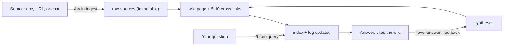
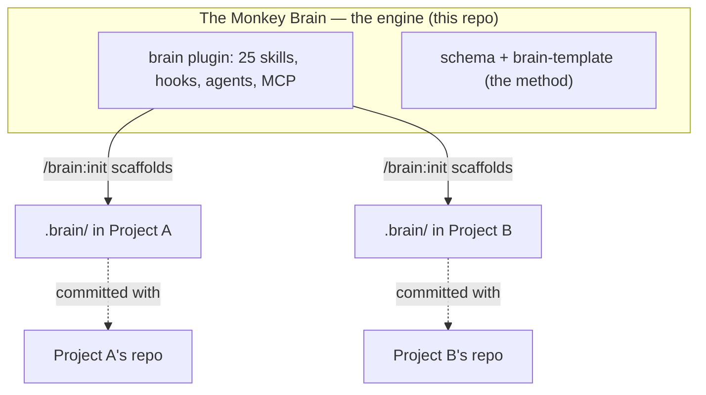

# 🐵 The Monkey Brain

> A reusable **knowledge engine** you drop into any project. Each project grows its own
> isolated, **compounding** wiki — its topics, context, and memories — maintained by Claude Code
> instead of by you.


The Monkey Brain turns Claude Code into a **librarian for your project**. Instead of re-reading
raw documents on every question (RAG), it **compiles knowledge once** into a persistent,
interlinked markdown wiki and keeps it current — so cross-references, contradiction flags, and
synthesis already exist *before* you ask. Knowledge accumulates instead of being re-derived.

> **You curate** (sources, questions, direction). **The engine maintains** (summarizing,
> cross-referencing, filing, linting, remembering). **Obsidian is the IDE; the wiki is the codebase.**

---

## Table of contents

- [What is The Monkey Brain?](#what-is-the-monkey-brain)
- [Features](#features)
- [Quickstart](#quickstart)
- [How it works](#how-it-works)
- [Architecture](#architecture)
- [Structure](#structure)
- [All skills](#all-skills)
- [All hooks](#all-hooks)
- [Capability plugins](#capability-plugins)
- [MCP servers](#mcp-servers)
- [User guide](#user-guide)
- [Requirements](#requirements)
- [The example brain](#the-example-brain)
- [Credits & license](#credits--license)

---

## What is The Monkey Brain?

Most AI workflows re-retrieve the same source documents on every question and re-derive the same
answers, forgetting everything between sessions. The Monkey Brain does the opposite: it builds a
**second brain that compounds**.

It is an implementation of the [**LLM Wiki pattern**](https://gist.github.com/karpathy/442a6bf555914893e9891c11519de94f)
(Andrej Karpathy) — itself a modern take on Vannevar Bush's 1945 *Memex*. The idea: rather than
retrieval-augmented generation over raw files, the LLM **incrementally builds and maintains a
persistent, interlinked wiki**. Every source you feed it is summarized, cross-linked to 5–10
related pages, indexed, and logged. Every question is answered from that wiki, and good novel
answers are **filed back** as new pages. The knowledge base gets richer with use.

**Two roles, cleanly split:**

| You (the curator) | The engine (the maintainer) |
| --- | --- |
| Choose sources & set direction | Summarize sources into wiki pages |
| Ask questions | Answer from the wiki, cite pages |
| Approve plans & decisions | Cross-link, index, log, lint, remember |
| Review the output | Enforce the rules automatically |

**One engine, many isolated brains.** This repository is *the engine* — a Claude Code plugin. It
holds no project knowledge itself. Instead it scaffolds a `.brain/` folder into each of your
projects; that folder is committed with the project's own git and stays **completely isolated**
from every other project. Knowledge never bleeds across projects.

The engine stands on three pillars:

- **Compound** — the LLM wiki: compile-time cross-linking, provenance, contradiction flags.
- **Enforce** — hooks and gates make the rules non-negotiable (*enforcement over advice*).
- **Economize** — token discipline, model routing, and deferred tools keep it cheap.

---

## Features

**🧠 A compounding knowledge base**
- The **knowledge SDLC**: `ingest → query → lint → wrap`, each step a `/brain:*` skill.
- Sources become cross-linked wiki pages with YAML provenance; novel answers file themselves back.
- Three-layer knowledge model: **raw-sources** (immutable) → **wiki** (LLM-owned) → **schema** (config).
- Ships with a browsable **Obsidian** vault: graph view, Dataview dashboard, Marp deck.

**🛡️ Enforcement, not just advice**
- **10 lifecycle hook events (11 scripts)** enforce rules the model can't "forget."
- Hard gates: **secrets** blocking, **raw-sources immutability**, **append-only log**, a
  **plan gate** (architecture tier) and a **TDD gate** (feature+ tiers).
- **Self-healing wiki checks** repair broken links / orphans in the same turn.
- **Learned bans** — a correction made three times becomes a rule, and a rule with a `ban:` pattern
  becomes enforcement: flagged right after the write, or refused before it. The product-design
  pack ships its UI anti-patterns the same way.
- A budgeted **session-start context injection** (≤3k tokens) — no "did the manual load?"
- **Always-on recall** — built-in search over the brain (`brain_search`, `/brain:brief`), and each
  session's first prompt is matched against it. No database, no embeddings, nothing to install.

**⚡ Token discipline with receipts**
- **Terse output on by default** (Caveman-style, ~65% shorter; `/brain:terse off` for a
  session, a `.no-terse` file to disable) and `/brain:compress` (permanent instruction-file
  compression, ~46% input savings) — never touching code, specs, or acceptance criteria.
- **[Caveman](https://github.com/juliusbrussee/caveman)'s token trio, built in** — terse output,
  `/brain:compress` (≈ `/caveman-compress`) and `/brain:usage` (≈ `/caveman-stats`, but read from
  Claude Code's real transcripts). No need to install Caveman alongside the brain: both inject
  compression rules every turn, so running them together pays for the same rules twice.
- **Model routing** by default: scripts do deterministic work at 0 tokens; Sonnet does routine
  execution; the main model does judgment. Two Sonnet fan-out subagents for parallel work.
- **Real receipts** — `/brain:usage` reads Claude Code's own transcripts: tokens per day, model and
  branch, and the prompt-cache hit ratio. The doctor flags prompt-rewriting proxies and agents that
  come back empty.

**🔧 A full development lifecycle**
- `research → plan → build → review`, filed back to the brain: specs with numbered acceptance
  criteria, ADRs in `decisions/`, and auto-learned **instincts** from repeated corrections.
- **Loops that stop** — `/brain:loop` iterates a build, research or design cycle until the brain
  says it's done (every AC ✅, a stable recommendation, no open P0), halting on livelock, stalls or
  a tick cap. Verification must run on a different model family than the work.
- **Blast-radius sizing** — `/brain:plan` scans the import graph (JS/TS, Python, Go, C#; no
  dependencies) and suggests the spec's tier and model from what the change actually touches.
- **Daily drivers** — standup and weekly-review digests, `dump` for loose notes, a one-page HTML
  dashboard per project (and one HTML dashboard for *every* project on the machine, with combined
  token usage), one-step CI, plus idea validation, URL critiques and meeting prep. Each one files
  its result back into the brain.
- **Team mode** — share one brain across a team: append-only logs merge without conflicts,
  per-machine caches stay out of git, and `/brain:lock` keeps two people off the same spec.
- **Life packs (optional)** — `/brain:learn` for spaced-repetition learning (only due cards enter
  context) and `/brain:career` for case studies, CVs and mock interviews, kept in a private folder
  that's never committed or indexed.

**📦 Domain expertise, on tap**
- A **product-design pack** (Nielsen heuristics + WCAG 2.2 AA + method catalog) with a validation
  gate that blocks "done" on open P0s.
- A **game pipeline** (`/brain:game`: concept → GDD → prototype → playtest → balance).
- **Capability plugins included** — 5 ship with it (auto-installed from the official
  marketplace), 4 more it offers, and an opt-in `brain-all` bundle adds every official plugin —
  *plugins do the craft; the brain records the knowledge.*

**🩺 Health monitoring**
- `/brain:doctor` runs **20 deterministic checks** (links, orphans, staleness, budget, WIP, cache safety, CI,
  open P0s, schema drift…). Failures inject a health report into the *next* session.

**25 `/brain:*` skills · 10 hook events · 2 subagents · 4 bundled + 5 offered plugins · cross-platform (Node).**

---

## Quickstart

Install the plugin once (this repo doubles as its own marketplace):

```
/plugin marketplace add NeamulMorshed/The-Monkey-Brain
/plugin install brain@monkey-brain
```

That one install also installs and enables four capability plugins from Anthropic's official
marketplace: github, frontend-design, superpowers, security-guidance (needs Python 3.10+).
`/brain:init` offers the rest, code-modernization included.
Want every official plugin? `/plugin install brain-all@monkey-brain` — opt-in, and heavy on
context (each enabled plugin costs tokens every turn; connectors still need your own login).
If `/plugin` reports a missing dependency, the official marketplace isn't added yet:
`/plugin marketplace add anthropics/claude-plugins-official`.

Then, in any project:

```
"start a brain here"          →  scaffolds .brain/ (or run /brain:init)
"ingest this <doc/url>"       →  compiles it into the wiki
"what do we know about X?"    →  answers from the wiki, files novel answers back
"lint the brain"              →  health-checks links, orphans, staleness
"wrap up"                     →  logs the session, updates the index, commits
```

Natural phrases are the primary interface — a trigger hook maps them to the right skill — or call
the `/brain:*` skills directly. That's it; the hooks handle the bookkeeping.

> **No plugin?** The original **bootstrap scripts** still work:
> `.\bootstrap\new-brain.ps1 -Project "C:\code\myproduct" -Name "MyProduct"` (PowerShell) or
> `./bootstrap/new-brain.sh /code/myproduct "MyProduct"` (bash).

---

## How it works

### The knowledge loop (SDLC)


```mermaid
flowchart LR
    S["Source: doc, URL, or chat"] -->|/brain:ingest| RS["raw-sources (immutable)"]
    RS --> W["wiki page + 5-10 cross-links"]
    W --> IDX["index + log updated"]
    Q["Your question"] -->|/brain:query| IDX
    IDX --> A["Answer, cites the wiki"]
    A -->|novel answer filed back| SY["syntheses"]
    SY --> W
```

1. **Ingest** — a source is copied verbatim to `raw-sources/` (never edited again), summarized to
   a `wiki/` page, cross-linked to 5–10 related pages, added to the index, and logged.
2. **Query** — questions are answered *index-first* from the compiled wiki; genuinely new answers
   are written back to `wiki/syntheses/` so the next question starts from them.
3. **Lint** — a mechanical scan (broken links, orphans, frontmatter gaps, index drift) runs first,
   then the model reasons over contradictions and staleness.
4. **Wrap** — definition-of-done: verify, refresh the index, append the log, commit.

### The development loop

For building things (not just knowing them), the same discipline applies to code:

`research` (filed with sources) → `plan` (a spec with numbered acceptance criteria + a tier, whose
approval **only you** can grant) → `build` (test-first against the criteria) → `review` (verified
AC-by-AC, findings filed back as ADRs and **instincts**).

### Enforcement fires regardless

The value isn't the workflow — it's that the workflow **can't be skipped**. Hooks run on every
session and every tool call:

| When | What happens |
| --- | --- |
| **Session start** | A budgeted status block is injected (index stats, active specs, decisions, health) — the brain is aware before your first word. |
| **You type a phrase** | "ingest this", "wrap up", "brain doctor"… routes to the right skill deterministically. |
| **Any write** | Gates check for **secrets**, block edits to **immutable** raw-sources, keep the **log append-only**, and enforce **plan**/**TDD** gates by tier. |
| **A wiki page changes** | Links and orphans are checked and self-healed in the same turn. |
| **Compaction / session end** | A snapshot is saved so nothing is lost; the log and index update automatically. |

### Five-layer activation

"Works whenever needed" is five mechanisms, each catching what the last missed: **(1)** the plugin
is present in every session; **(2)** session-start awareness; **(3)** three routers — deterministic
phrases, model-driven skill descriptions, and path/context matchers; **(4)** always-on enforcement
gates; **(5)** depth on demand (packs and semantic search stay deferred until a task needs them).

### Model routing (the right model per job)

| Work class | Runs on |
| --- | --- |
| Deterministic checks (lint, guards, doctor) | **scripts — no model, 0 tokens** |
| Classification & triage | **Haiku** |
| Routine execution (ingest, research reads, build) | **Sonnet** |
| Judgment & synthesis (plans, reviews, reconciliation) | **main model — Opus/Fable** |

---

## Architecture

### Engine vs. instances


```mermaid
flowchart TB
    subgraph Engine["The Monkey Brain — the engine (this repo)"]
        P["brain plugin: 25 skills, hooks, agents, MCP"]
        BT["schema + brain-template (the method)"]
    end
    P -->|/brain:init scaffolds| I1[".brain/ in Project A"]
    P -->|/brain:init scaffolds| I2[".brain/ in Project B"]
    I1 -.committed with.-> RA["Project A's repo"]
    I2 -.committed with.-> RB["Project B's repo"]
```

Improvements to the **method** are made once in the engine and pulled into instances with an
`-Update` migration that **never touches accumulated knowledge**. Each `.brain/` is its own
graph, log, and memory — no cross-project bleed.

### The three knowledge layers

| Layer | Owner | Rule |
| --- | --- | --- |
| `raw-sources/` | You (inputs) | **Immutable** — copied in, never edited (hook-enforced). |
| `wiki/` | The LLM | Compiled, cross-linked, lint-clean; every page has ≥1 inbound link. |
| `schema/` | Config | The operating manual, templates, and tiers. |

v2 adds **record layers** for the development lifecycle: `specs/`, `projects/`, `sessions/`,
`decisions/` (ADRs), and `instincts/` (auto-learned correction rules).

### Inside the plugin

- **25 skills** (`/brain:*`) — the knowledge SDLC, the develop lifecycle, token discipline, the
  product-design pack, the game pipeline, and doctor.
- **10 lifecycle hook events (11 scripts)** — the enforcement + automation layer (Node, stdlib-only,
  one runtime on Windows/macOS/Linux).
- **2 Sonnet subagents** — `brain-librarian` (batch ingest) and `brain-researcher` (read-only
  research fan-out) run routine/parallel work in isolated context windows.
- **1 MCP** — `brain-search`: built-in recall (`brain_search`, `brain_brief`) in every brain; it
  hands off to qmd when a brain opts into meaning-based search.

---

## Structure

```
~/.claude/monkey-brain/         ← USER-LEVEL, not project-scoped
├── projects.json                 ← every .brain/ this machine has opened (registers itself)
└── home.html                     ← generated by /brain:home — one dashboard across all of them

The-Monkey-Brain/               ← THE ENGINE (this repo)
├── README.md                   ← you are here
├── .claude-plugin/             ← marketplace manifest (this repo is its own marketplace)
├── plugin/                     ← the `brain` plugin — see plugin/README.md
│   ├── skills/                 ←   25 /brain:* skills (init, ingest, query, brief, lint, wrap,
│   │                           ←     research, plan, build, review, terse, compress,
│   │                           ←     product-design, game, doctor, usage, loop, digest,
│   │                           ←     dump, dashboard, home, ci, lock, learn, career)
│   ├── hooks/                  ←   hooks.json + Node scripts (status, router, guards, …)
│   ├── agents/                 ←   brain-librarian, brain-researcher (Sonnet)
│   └── .mcp.json               ←   brain-search (built-in recall; qmd opt-in)
├── bootstrap/                  ← original scaffold path (new-brain.ps1/.sh, lint-brain.ps1)
├── schema/
│   ├── CLAUDE.md               ←   canonical operating manual (the method)
│   ├── templates/              ←   page skeletons (source/concept/entity/synthesis + specs…)
│   └── brain-template/         ←   exactly what gets copied into a new .brain
└── examples/
    └── claude-code-brain/      ←   a complete worked brain (66 pages) to learn from

<your-project>/.brain/          ← AN INSTANCE (scaffolded by /brain:init; committed with the project)
├── CLAUDE.md                   ← loads as the operating manual when you run claude here
├── Clippings/                  ← Obsidian Web Clipper staging (gitignored, pre-raw-sources)
├── raw-sources/                ← immutable inputs
├── wiki/                       ← {index, log, dashboard, sources, concepts, entities, syntheses, research}
├── specs/  projects/           ← acceptance-criteria specs · per-workstream status (tier, phase)
├── sessions/  decisions/       ← auto-written session logs & snapshots · ADRs (the "why")
├── instincts/                  ← {pending, active}/ auto-learned correction rules
├── private/                    ← career pack material — gitignored, never indexed
├── learning/                   ← learn pack decks (SM-2 spaced repetition)
├── LOCK.md                     ← present only while a teammate holds the work lock
└── memory/                     ← durable project facts
```

---

## All skills

Every `/brain:*` command. Natural phrases route to the same skill automatically (hook #2) —
these are the explicit form. Full detail (model routing, fan-out) lives in
[`plugin/skills/README.md`](plugin/skills/README.md).

**Knowledge SDLC**

| Skill | What it does |
| --- | --- |
| `/brain:init` | Scaffold `.brain/` into the current project; wires the root `CLAUDE.md` import; offers capability plugins and MCP servers |
| `/brain:ingest [source]` | 8-step compile of a source into the cross-linked wiki |
| `/brain:query <question>` | Index-first answer with citations; novel answers filed back to `syntheses/` |
| `/brain:brief <topic>` | A ≤ ~2k-token cited context pack from built-in search |
| `/brain:lint` | Mechanical scan (broken links, orphans, frontmatter) + reasoning over contradictions/staleness |
| `/brain:wrap` | Definition-of-done: verify, sync log + index, commit |
| `/brain:doctor` | 20-check health report; failures surface at the next session start |

**Development lifecycle**

| Skill | What it does |
| --- | --- |
| `/brain:research <topic>` | Web + codebase research, filed to `wiki/research/` with sources |
| `/brain:plan <feature>` | Writes `specs/` with numbered ACs + a tier (sized by the import-graph blast radius); approval is curator-owned |
| `/brain:build <spec>` | Test-first implementation against a spec's ACs, gates armed |
| `/brain:review [spec\|branch\|PR#/URL]` | AC-by-AC verification; files ADRs + instinct candidates; a PR reads its diff + CI checks via `gh` (read-only) |
| `/brain:loop <spec\|research\|design>` | Bounded loop that stops on the brain's own criteria (every AC ✅, a stable recommendation, no open P0) |

**Daily drivers**

| Skill | What it does |
| --- | --- |
| `/brain:digest [week]` | Standup, or the weekly review — blocked / done / in-flight, filed to `sessions/` |
| `/brain:dump <note>` | Classifies a loose note and files each part (decision, fact, next step, idea, link, correction) |
| `/brain:dashboard` | One-page, self-contained HTML overview of the current project's brain |
| `/brain:home` | One dashboard for **every** Monkey Brain project on this machine — status, open work, and combined token usage |
| `/brain:ci` | Detects the project's stack and writes a GitHub Actions workflow |
| `/brain:lock <spec\|brain>` | Takes the team work lock so two people don't edit the same thing |

**Token discipline**

| Skill | What it does |
| --- | --- |
| `/brain:terse [off]` | Output-compression mode — **on by default**; toggles per session |
| `/brain:compress <file>` | Permanently shrinks an instruction file (~46% input savings), with receipts |
| `/brain:usage` | Real token usage from Claude Code's own transcripts — per day, model, branch, cache-hit ratio |

**Domain work**

| Skill | What it does |
| --- | --- |
| `/brain:product-design` | 5-phase product-design process (personas, journeys, ideation, design, validation) |
| `/brain:game` | Game pipeline: concept → GDD → prototype spec → build → playtest → balance |
| `/brain:learn <topic>` | Spaced-repetition learning (SM-2) — only due cards enter context |
| `/brain:career` | Private case studies, CV, skill matrix, mock interviews (never committed or indexed) |

Idea validation, URL critique, and meeting prep are *modes* of `/brain:research`,
`/brain:product-design`, and `/brain:brief` — say what you want in plain language and the right
one activates, so the always-on skill list stays short.

---

## All hooks

Nine lifecycle events, eleven Node scripts — the enforcement layer that runs whether or not the
right skill got invoked. Full technical detail in [`plugin/README.md`](plugin/README.md).

| # | Fires on | Script(s) | What it does |
| --- | --- | --- | --- |
| 1 | Session start | `brain-status` | Injects a budgeted (≤3k token) status block: index stats, active specs/projects, decisions, health report, running loops, a team lock if one is held, terse-mode rules. Offers `/brain:init` in brainless projects; registers/refreshes the project in this machine's project registry, which `/brain:home` reads. |
| 2 | Every prompt | `trigger-router` + `recall` | Routes natural phrases ("ingest this", "wrap up"…) to the right skill; **plan before build** — any development request ("add a login feature", "fix the crash on upload") is routed to `/brain:plan` unless an open spec already covers it (then `/brain:build`); searches the brain for the session's first prompt and surfaces matching pages. |
| 3 | Before a file write | `guards` | Blocks secrets in any file; blocks edits to immutable raw sources; keeps the log append-only; enforces the plan gate (architecture tier) and TDD gate (feature+ tier); refuses writes matching a `block`-level learned ban or inside a teammate's active lock; keeps uncleared career case studies private. |
| 4 | After a wiki write | `wiki-check` + `instinct-track` | Self-heals broken links and orphans in the same turn; advises an instinct when a file is revised across 3+ sessions; reports `warn`-level learned bans right after the write. |
| 5 | Before compaction | `snapshot` | Saves a working-state snapshot (next steps, active specs/projects, recent log) so nothing is lost. |
| 6 | Session stop/end | `wrap` | Nudges an unlogged session before it ends; refreshes index stats; re-indexes semantic search if enabled. |
| 7 | Agent dispatch / subagent finish | `agent-track` | Logs every dispatch and requires an explicit model for expensive ones; records each subagent's real outcome and token count; blocks a verifier that shares the generator's model family during a loop. |
| 8 | Session start + task events | `resume` / `resume-log` | Injects `resume.md` and asks whether to continue; auto-logs task/session events. |
| — | MCP tool calls | `search-mcp` | Serves `brain_search` and `brain_brief` (built-in recall) in every brain; hands off to qmd for vector search when a brain opts in. |

---

## Capability plugins

Skills own the brain's *knowledge* work; **craft** — UI builds, security review, PR flow, PRDs —
is done by capability plugins. The rule: *plugins do the craft; the brain records the knowledge* —
every plugin's decisions, findings, and artifacts get filed into `.brain/` by the brain's own
skills and hooks.

**Ship automatically** — installed and enabled the moment you install `brain`:

| Plugin | Fires on | Files into |
| --- | --- | --- |
| [github](https://claude.com/plugins/github) | PR / issue / CI work | `wiki/syntheses/`, `projects/` |
| [frontend-design](https://claude.com/plugins/frontend-design) | any UI build | `decisions/`, `projects/` |
| [superpowers](https://claude.com/plugins/superpowers) | build / debug phases | `wiki/`, `instincts/pending/` |
| [security-guidance](https://claude.com/plugins/security-guidance) (needs Python 3.10+) | auth / crypto / input-handling code | `wiki/syntheses/`, `projects/` (P0s gate wrap) |

**Offered, not forced** — `/brain:init` suggests these when they fit the project; you approve each install:

| Plugin | Fires on | Files into |
| --- | --- | --- |
| [code-modernization](https://claude.com/plugins/code-modernization) | legacy refactors | `wiki/research/` |
| [product-tracking-skills](https://claude.com/plugins/product-tracking-skills) | product / metrics work | `projects/` |
| [productivity](https://claude.com/plugins/productivity) | standup / planning triggers | `sessions/` |
| [product-management](https://claude.com/plugins/product-management) | PRD / roadmap requests | `raw-sources/` → ingested |
| [ui-ux-pro-max](https://github.com/nextlevelbuilder/ui-ux-pro-max-skill) | UI/UX design-system requests | `decisions/`, `instincts/pending/` |

**Everything at once:** `/plugin install brain-all@monkey-brain` — an opt-in bundle of every
plugin in Anthropic's official marketplace (minus the output styles that contradict terse mode).
Heavy on context; only worth it if you want maximum coverage and don't mind the token cost.

---

## MCP servers

Same contract, extended to MCP servers: *MCP servers do the craft; the brain records the
knowledge.* The brain never installs a server, runs its setup command, or touches a credential —
`/brain:init` just recognizes ones you've already connected (or offers the curated set and hands
you the exact `claude mcp add …` command to run yourself) and knows which `.brain/` folder their
output belongs in.

| Server | Fires on | Files into |
| --- | --- | --- |
| [Supabase](https://github.com/supabase-community/supabase-mcp) | schema, migrations, RLS, edge functions | `decisions/`, `wiki/entities/` |
| [Firebase](https://github.com/firebase/firebase-tools/tree/master/src/mcp) | auth, Firestore schema, functions, hosting config | `decisions/`, `wiki/entities/` |
| Figma | UI/design-system work referencing a Figma file | `decisions/` (same folder frontend-design/ui-ux-pro-max write to) |
| Framer | design/prototype/publish work in Framer | `decisions/`, `wiki/entities/` |
| Vercel | deploy config, env vars, domains, build/runtime status | `decisions/`, `projects/` |

A connected server outside this curated set is still surfaced (a generic "no filing rules yet"
note) rather than going unmentioned. Notion is deferred — pulling content from it fits `/brain:ingest`
as a source, not an ADR, and needs its own design.

---

## User guide

### 1. Start a brain

Say **"start a brain here"** (or run **`/brain:init`**) inside a project. This scaffolds `.brain/`
and, if needed, drops a one-line root `CLAUDE.md` that imports it (`@.brain/CLAUDE.md`) so the
operating manual always loads. The five core **capability plugins** already came with the
plugin; `/brain:init` offers the relevant rest (ui-ux-pro-max, product-management, …) — it never
installs silently.

### 2. Feed it knowledge

Drop a doc/spec/article into `.brain/raw-sources/`, clip a web page into `.brain/Clippings/` via
the Obsidian Web Clipper, or just paste text in chat — then say **"ingest this."** The engine
compiles it into a cross-linked wiki page and updates the index and log.

### 3. Ask it things

Ask normally — **"what do we know about X?"**, **"how did we decide Y?"** Answers cite wiki pages;
good novel answers are filed back to `syntheses/` so the knowledge compounds.

### 4. Build with it

| You want to… | Say / run | The engine… |
| --- | --- | --- |
| Explore a topic | `/brain:research <topic>` | files findings to `wiki/research/` with sources |
| Write a spec | `/brain:plan <feature>` | writes `specs/` with numbered ACs + a tier; **you** approve |
| Implement it | `/brain:build <spec>` | works test-first against the ACs, gates armed |
| Review it | `/brain:review` | verifies AC-by-AC; files ADRs + instincts |
| Design a product | "design a product" / product-design pack | runs a 5-phase process; a11y/heuristic P0s gate done |
| Make a game | `/brain:game` | concept → GDD → prototype → playtest → balance |

### 5. Keep it healthy

- **"lint the brain"** (`/brain:lint`) — catch broken links, orphans, and stale claims.
- **"brain doctor"** (`/brain:doctor`) — 20-check health report; failures surface next session.
- **"wrap up"** (`/brain:wrap`) — end-of-session: verify, log, refresh the index, commit.
- **Terse output is on by default** — `/brain:terse off` (or "be more verbose") for a session;
  an empty `.no-terse` at the project root or `MONKEY_BRAIN_TERSE=0` turns it off for good.
- `/brain:compress <file>` — permanently shrink a bloated instruction file.

### 6. Browse it (optional)

Open `.brain/` as an **Obsidian** vault for the graph view, the Dataview dashboard, and clickable
links. It's just markdown, so it also reads fine in any editor or on GitHub.

### Maintaining the method

```powershell
# Refresh an existing brain's schema to the latest engine version (never touches knowledge)
.\bootstrap\new-brain.ps1 -Project "C:\code\myproduct" -Update
# Health-check any brain from outside a session
.\bootstrap\lint-brain.ps1 -Brain "C:\code\myproduct\.brain"
```

> **Loading caveat.** Claude Code reads `CLAUDE.md` from the working directory *up to the repo
> root*. If your brain's manual doesn't load (check with `/memory`), either launch `claude` from
> inside `.brain\`, or keep the root `CLAUDE.md` with `@.brain/CLAUDE.md`. With the plugin
> installed, the session-start hook injects brain status regardless.

---

## Requirements

- **Claude Code** — drives every workflow and hosts the plugin.
- **Node.js ≥ 18** — the plugin's hook runtime (one runtime on Windows/macOS/Linux, no npm deps).
- **Git** — to version each project's `.brain/` alongside its code.
- **Obsidian** *(optional)* — to browse the vault; with **Dataview** (dashboards) and optionally
  **Marp** (decks).
- **PowerShell** (Windows) or **bash** (macOS/Linux) — only for the original bootstrap/lint scripts.

---

## The example brain

[`examples/claude-code-brain/`](examples/claude-code-brain/) is a real, finished brain: **15
sources compiled into 66 cross-linked, lint-clean pages** (0 broken links, 0 orphans), with a
Mermaid index map, a Dataview dashboard, and a Marp overview deck. It's the best way to see what a
mature brain looks like — start at its [`wiki/index.md`](examples/claude-code-brain/wiki/index.md).

---

## Credits & license

Built on the [LLM Wiki pattern](https://gist.github.com/karpathy/442a6bf555914893e9891c11519de94f)
by Andrej Karpathy (lineage: Vannevar Bush's 1945 *Memex*). Its enforcement, token-discipline, and
domain-pack designs were sharpened against three studied projects:
[Caveman](https://github.com/juliusbrussee/caveman) (token economy), an enforcement-focused
Claude Code workspace design (hard hook gates over advisory rules), and
[ui-ux-pro-max](https://github.com/nextlevelbuilder/ui-ux-pro-max-skill) (domain-expertise packs).

See [`plugin/README.md`](plugin/README.md) for plugin internals and [`ROADMAP.md`](ROADMAP.md) for
the full design rationale and build log.

**License:** [MIT](LICENSE).
