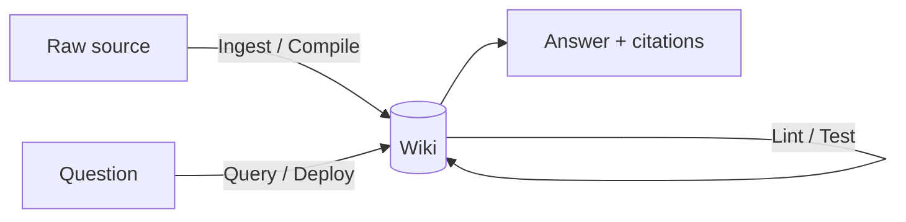

# Knowledge SDLC

The three operations that run the [[llm-wiki-pattern]], framed as a software lifecycle.
Full procedures live in the [[schema-layer|schema]] (`schema/CLAUDE.md`).

## [[ingest-compile|Ingest — Compile]]
Read source → summary page → cross-link 5–10+ related pages → update [[index-and-log|index]]
→ append [[index-and-log|log]] → commit. One source typically touches **10–15 pages**.

## [[query-deploy|Query — Deploy]]
Read index → drill into relevant pages → synthesize answer **with citations** → **file good
answers back** as new [[syntheses]] pages so explorations compound.

## [[lint-test|Lint — Test]]
Health-check: contradictions, stale claims, orphan pages, missing pages, missing
cross-references, broken links, data gaps. Suggest new questions/sources.

## Sources
- [[llm-wiki]]
