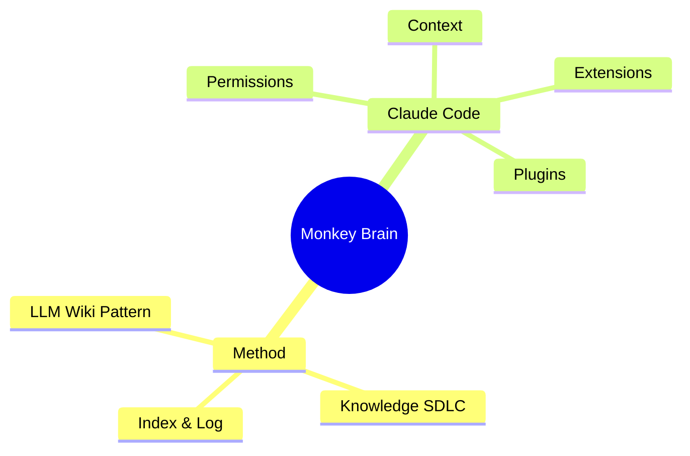

# 🐵 The Monkey Brain — Index

The content catalog for this [[llm-wiki-pattern|LLM wiki]]. **Read this first** on any
[[query-deploy|query]] to locate pages, then drill in. Updated on every
[[ingest-compile|ingest]]. For the chronological view, see [[log]]. For conventions, see
[`schema/CLAUDE.md`](../schema/CLAUDE.md).

> **Stats:** 16 sources · 67 wiki pages · last updated 2026-07-17.

---

## 🧭 Start here
- [[llm-wiki-pattern]] — the founding idea this vault instantiates.
- [[knowledge-sdlc]] — how it runs: [[ingest-compile|ingest]] · [[query-deploy|query]] · [[lint-test|lint]].
- [[claude-code]] — hub for the Claude Code subject area.
- [[dashboard]] — live Dataview tables (health, hubs, orphans) · [[vault-overview-deck]] — slide tour.

---

## 📥 Sources (`/sources`)
Distilled summaries of each immutable [[raw-sources-layer|raw source]].

| Page | Summary |
| --- | --- |
| [[sources/llm-wiki\|LLM Wiki (Karpathy)]] | The founding pattern: build a compounding wiki, not RAG. |
| [[sources/permission-modes\|Choose a Permission Mode]] | Six Claude Code permission modes + rules + protected paths. |
| [[sources/context-window\|Explore the Context Window]] | What loads into context, what each thing costs, compaction. |
| [[sources/extend-claude-code\|Extend Claude Code]] | When to use CLAUDE.md / skills / hooks / MCP / subagents / plugins. |
| [[sources/frontend-design-plugin\|Frontend Design Plugin]] | Plugin for distinctive, non-generic frontends. |
| [[sources/superpowers-plugin\|Superpowers Plugin]] | TDD / debugging / brainstorming methodology framework. |
| [[sources/hooks-reference\|Hooks Reference]] | Full hook events, handler types, exit-code/decision protocol. |
| [[sources/skills-authoring-guide\|Skills Authoring Guide]] | SKILL.md format, frontmatter, invocation control, context: fork. |
| [[sources/qmd-readme\|qmd README]] | On-device hybrid markdown search (BM25+vector+rerank), CLI + MCP. |
| [[sources/permissions-reference\|Permissions Reference]] | allow/ask/deny syntax, per-tool patterns, settings precedence, managed policy. |
| [[sources/mcp-guide\|MCP Guide]] | Transports, scopes, OAuth, resources/prompts, Tool Search. |
| [[sources/subagents-guide\|Subagents Guide]] | Definition files, frontmatter, scopes, built-in agents, startup. |
| [[sources/memex-as-we-may-think\|As We May Think (Bush, 1945)]] | Citation stub: the memex, associative trails — primary-source provenance for the [[llm-wiki-pattern]] kinship claim. |
| [[sources/caveman-readme\|Caveman README]] | Token discipline: ~65% output compression, permanent memory-file compression, receipts culture. |
| [[sources/mewvault-readme\|MewVault README]] | Enforcement over advice: 7 hooks, hard gates, tiers, 3k budgeted injection, instincts, doctor. |
| [[sources/ui-ux-pro-max-readme\|ui-ux-pro-max README]] | Design-intelligence pack: 161 reasoning rules + BM25 search + design-system generator. |

---

## 🧠 Concepts (`/concepts`)

### Method & architecture
| Page | One-liner |
| --- | --- |
| [[llm-wiki-pattern]] | Compile knowledge into a persistent, compounding wiki. |
| [[rag]] | The retrieve-on-every-query pattern this is defined against. |
| [[knowledge-sdlc]] | Ingest / Query / Lint operations. |
| [[ingest-compile]] | Compile a source into integrated wiki knowledge. |
| [[query-deploy]] | Answer from the wiki; file good answers back. |
| [[lint-test]] | Health-check for contradictions, orphans, stale claims. |
| [[raw-sources-layer]] | Layer 1: immutable inputs. |
| [[wiki-layer]] | Layer 2: LLM-owned markdown. |
| [[schema-layer]] | Layer 3: co-evolved config (CLAUDE.md). |
| [[index-and-log]] | The two navigation files. |
| [[obsidian-ecosystem]] | Web Clipper, graph view, Marp, Mermaid, git. |
| [[dataview]] | Query frontmatter into dynamic tables. |
| [[search-tooling]] | qmd & the search upgrade path (deferred). |

### Claude Code — permissions
| Page | One-liner |
| --- | --- |
| [[permission-modes]] | The six modes and how to switch them. |
| [[auto-mode]] | Classifier-guarded autonomy; blocks/allows; fallbacks. |
| [[plan-mode]] | Research & propose without editing. |
| [[protected-paths]] | Writes never auto-approved (except bypass). |
| [[permission-rules]] | Allow / ask / deny syntax & evaluation order. |
| [[read-only-commands]] | The built-in no-prompt Bash command set. |
| [[settings-precedence]] | managed > CLI > local > project > user; deny wins. |

### Claude Code — context
| Page | One-liner |
| --- | --- |
| [[context-window]] | What Claude knows in a session; what loads when. |
| [[compaction]] | Summarizing history at the limit; what survives. |
| [[claude-md]] | Always-on persistent context. |
| [[memory]] | Cross-session auto memory. |
| [[rules]] | `.claude/rules/`, optionally path-scoped. |

### Claude Code — extensions
| Page | One-liner |
| --- | --- |
| [[skills]] | On-demand knowledge & `/<name>` workflows. |
| [[skill-authoring]] | How to write a SKILL.md: frontmatter, fork, injection. |
| [[hooks]] | Deterministic automation on lifecycle events. |
| [[hook-events]] | The ~30 lifecycle events hooks can fire on. |
| [[mcp]] | Connect to external services/tools. |
| [[mcp-tool-search]] | Deferred MCP tool loading (keeps context low). |
| [[subagents]] | Isolated workers returning summaries. |
| [[built-in-subagents]] | Explore / Plan / general-purpose, and what they load. |
| [[agent-teams]] | Independent sessions messaging each other (experimental). |
| [[code-intelligence]] | Language-server navigation & diagnostics. |
| [[plugins]] | Packaging layer bundling the above. |
| [[claude-code]] | Subject-area hub. |

---

## 🏷️ Entities (`/entities`)
| Page | One-liner |
| --- | --- |
| [[frontend-design]] | Plugin for distinctive production-grade UI. |
| [[superpowers]] | Plugin for TDD/debugging/brainstorming methodology. |
| [[qmd]] | On-device hybrid search engine; the search upgrade path. |
| [[caveman]] | Token-discipline skill/plugin: compress output + memory files, with receipts. |
| [[mewvault]] | Federated workspace: hook-enforced gates, tiers, semantic memory, doctor. |
| [[ui-ux-pro-max]] | Design-intelligence expertise pack: data + BM25 + reasoning engine. |

---

## 🔬 Syntheses (`/syntheses`)
Filed-back analyses and comparisons (see [[query-deploy]]).

| Page | One-liner |
| --- | --- |
| [[claude-md-vs-skills-vs-hooks]] | Decision guide across all extension features + every pairwise comparison. |
| [[vault-overview-deck]] | Marp slide-deck overview of the whole vault. |
| [[dashboard]] | Dataview dashboard — live tables over page frontmatter. |

---

## 🗺️ Categories at a glance
- **16** sources · **38** concept pages (incl. [[concepts]] MOC) · **7** entity pages (incl. [[entities]] MOC)
  · **3** synthesis pages (incl. [[syntheses]] MOC) · plus this [[index]], the [[log]], and the [[dashboard]] = **67** total.
- Category maps-of-content: [[concepts]] · [[entities]] · [[syntheses]].
- Biggest hubs: [[claude-code]], [[knowledge-sdlc]], [[context-window]], [[skills]], [[plugins]].
