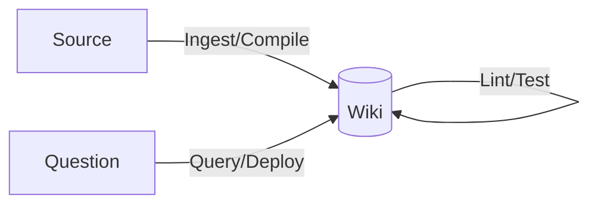

<!--
This is a Marp deck (filed-back query output). In Obsidian, use the Marp plugin to
present/export; or `marp wiki/syntheses/vault-overview-deck.md -o overview.pdf` with Marp CLI.
The frontmatter above doubles as a normal wiki page header (Marp ignores the extra keys it
doesn't use). Body slides are separated by `---`.
-->

# 🐵 The Monkey Brain
### A compounding, LLM-maintained knowledge base

Built on the [[llm-wiki-pattern|LLM Wiki pattern]] · 9 sources · 51 pages · 2026-06-17

---

## The problem with RAG

- Upload docs → retrieve chunks → answer → **forget**
- The LLM rediscovers knowledge **from scratch** every query
- Nothing accumulates; no standing cross-references or synthesis

> See [[rag]]

---

## The idea: compile, don't retrieve

- The LLM **builds and maintains a persistent wiki** between you and your sources
- Cross-references, contradiction flags, and synthesis exist **before** you ask
- Maintenance bookkeeping → near-zero cost for an LLM that never gets bored

> See [[llm-wiki-pattern]] · kin to Vannevar Bush's **Memex** (1945)

---

## Architecture — three layers

| Layer | Role |
| --- | --- |
| [[raw-sources-layer]] | Immutable inputs (read-only) |
| [[wiki-layer]] | LLM-owned markdown (this whole vault) |
| [[schema-layer]] | Co-evolved config (`schema/CLAUDE.md`) |

Curator sources & asks · **LLM does everything else** · Obsidian is the IDE

---

## The Knowledge SDLC

[[ingest-compile|Ingest]] · [[query-deploy|Query]] · [[lint-test|Lint]] — full procedures in the [[schema-layer|schema]]

---

## What's inside today

- **Method:** [[llm-wiki-pattern]], [[knowledge-sdlc]], [[index-and-log]], [[search-tooling]]
- **Claude Code — permissions:** [[permission-modes]], [[auto-mode]], [[protected-paths]]
- **Claude Code — context:** [[context-window]], [[compaction]], [[claude-md]]
- **Claude Code — extensions:** [[skills]] (+[[skill-authoring]]), [[hooks]] (+[[hook-events]]), [[mcp]], [[subagents]], [[plugins]]
- **Entities:** [[frontend-design]], [[superpowers]], [[qmd]]

> Full catalog: [[index]]

---

## A recurring motif the wiki surfaced

**Circuit-breaker after 3 failures** appears in two unrelated sources:

- [[auto-mode]] pauses after 3 consecutive classifier blocks
- [[superpowers]] triggers architectural review after 3 failed fix attempts

*This connection only exists because the wiki cross-links — it's the payoff of the pattern.*

---

## Scaling path

- The [[index-and-log|index file]] **is** the search engine to ~100 sources
- Past that: [[qmd]] — on-device hybrid (BM25 + vector + LLM rerank), CLI **or** [[mcp|MCP]] server
- Deliberate, local cousin of [[rag]] — added only when the index stops surfacing the right pages

---

## How to use it

1. Drop a clipping in `Clippings/` → say **"ingest this"**
2. Ask questions → good answers get **filed back** as [[syntheses]]
3. Periodically run a **[[lint-test|lint]]** to keep it healthy

> The human curates and asks. The LLM does the grunt work.

---

# Browse the graph

Open [[index]] · follow the links · watch it compound 🐵
